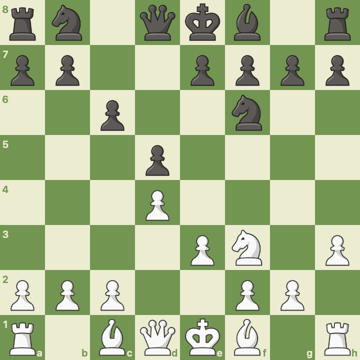
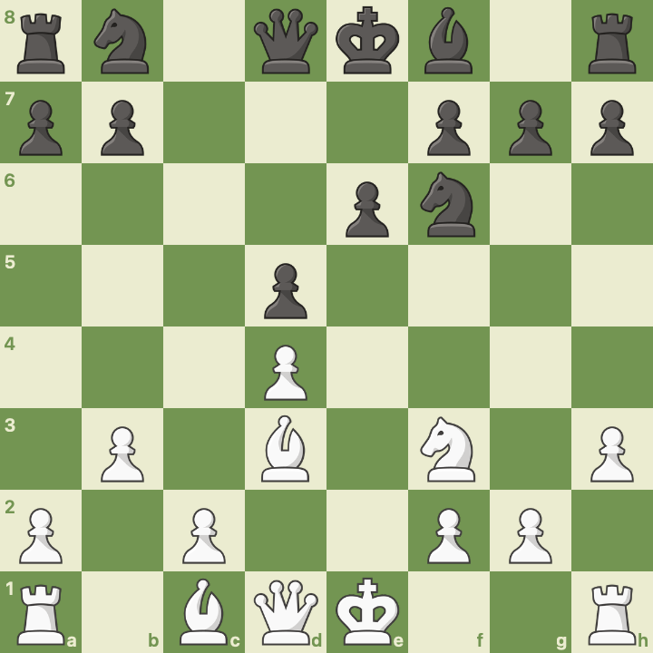
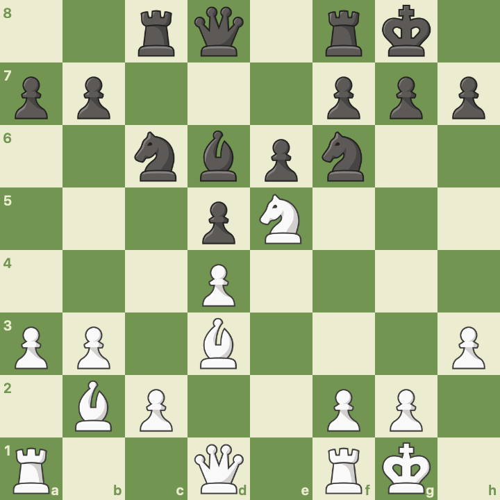
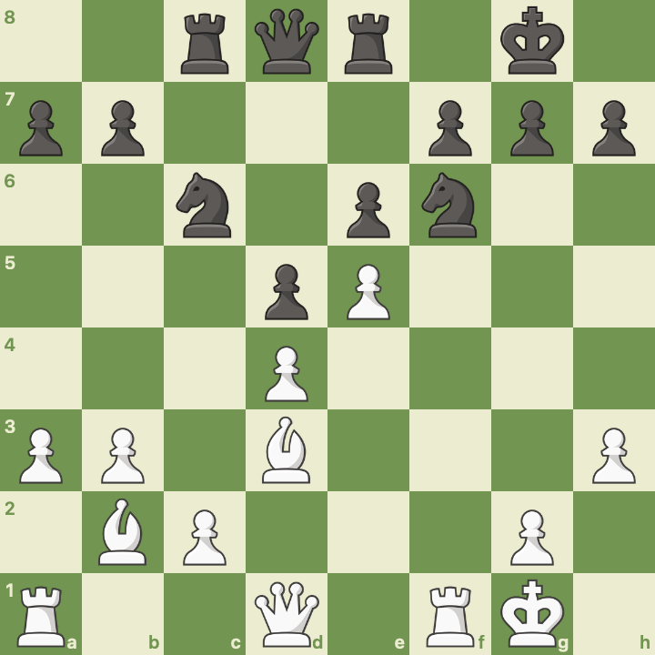
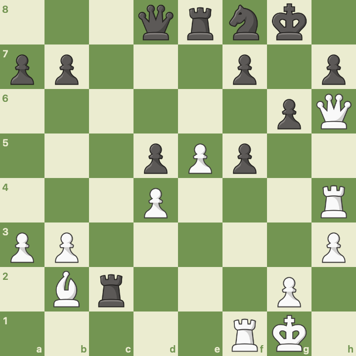
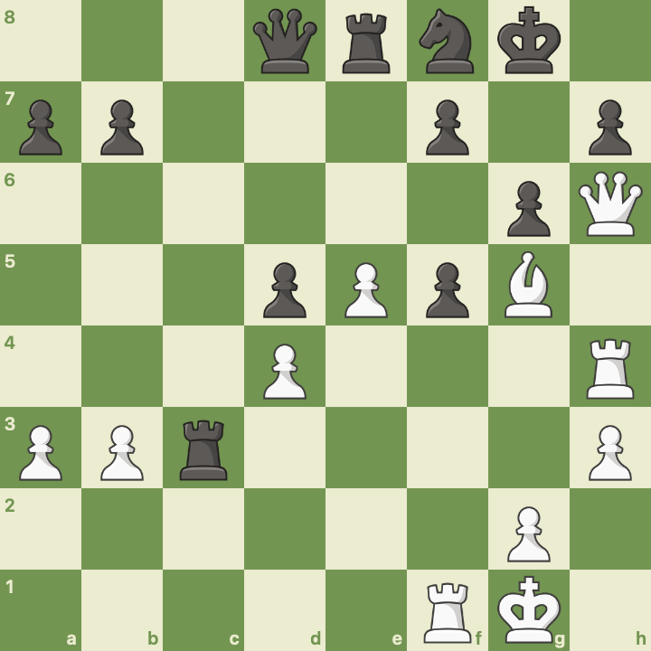
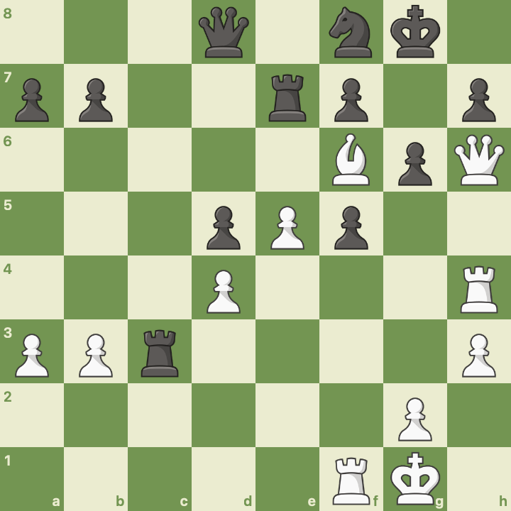

# Chess Diary

## 15 February 2026: Win vs tuan0429 (787)

**Opening:** Colle-Zukertort System | **Result:** 1-0 (Resignation) | **Time Control:** 10 min Rapid | **Unrated**

[View on Chess.com](https://www.chess.com/game/164704489298)

---

### Game Overview

Playing as White, I set up the Colle-Zukertort and executed the thematic kingside attack almost exactly as the system intends. I defended the centre, built up pressure, and broke through on the dark squares around Black's king. I felt in control for essentially the entire game. I don't recall having to make any awkward concessions to what my opponent was doing. The plan was to attack on the kingside using queen, bishop, and rooks, and the plan worked.

---

### The Opening (Moves 1–7)

**1. d4 c6 2. Nf3 d5 3. e3 Nf6 4. Nbd2 Bg4**

The first four moves establish the classic Colle setup: pawns on d4 and e3, knights on f3 and d2, with the light-squared bishop headed for d3. But on move 4, my opponent threw a spanner in the works with **4...Bg4**, pinning my knight to the queen.


*After 4...Bg4: Black pins the f3-knight. This is normally one of the trickier lines for Colle players, and the standard advice is to transpose into a Queen's Gambit. But here I had a different idea.*

**5. h3 Bxf3 6. Nxf3 e6**

I challenged the bishop immediately with **5. h3**, knowing that if it took on f3, I'd simply recapture with the d2-knight, which was already developed for exactly this purpose. The exchange actually helps White: the Colle structure is fully intact, White retains the bishop pair, and Black has given up their light-squared bishop for a knight. That bishop often plays a useful role in these positions, so it's a real concession.


*After 6. Nxf3: Colle structure restored. The knight recaptures smoothly and White's setup is undisturbed.*

**7. Bd3 c5**

With the bishop settled on d3 pointing at h7, the Colle-Zukertort setup is complete. Black strikes at the centre with ...c5.

---

### The Centre Opens (Moves 8–12)

**8. b3 cxd4 9. exd4 Bd6**

On move 8 I played **b3**, preparing to fianchetto the dark-squared bishop, the hallmark of the Zukertort variation. My opponent took on d4, and I recaptured with the e-pawn.


*After 9. exd4: The centre after Black's ...cxd4. The e-file is now half-open for White's rook, and the d4 pawn supports a future Ne5.*

I believed at the time that **8...cxd4** was an error for Black, since it opens the e-file for my rook and still allows me to play Ne5 in the future with the central pawn supporting it. Interestingly, the engine actually considers ...cxd4 to be Black's best move here, so my intuition was off on that one, but the resulting position still suited my plans well.

**10. O-O O-O 11. Bb2 Nc6 12. a3 Rc8**

Both sides castle and finish development. The bishop goes to b2, aiming at the kingside along the long diagonal. **a3** is prophylactic, preventing any ...Nb4 ideas where the knight could jump in and cause trouble on c2 or d3.

---

### Knight to the Outpost (Moves 13–15)

**13. Ne5 Re8**

The thematic move. The knight lands on e5, centralised and supported by the d4 pawn. From here it eyes f7, d7, and g6, all critical squares around Black's king.


*After 13. Ne5: The knight occupies the ideal outpost. White's pieces are all aimed at the kingside.*

**14. f4 Bxe5 15. fxe5 Nd7**

I pushed **f4** to reinforce the knight, but Black decided to trade it off with **14...Bxe5**. According to the engine, this was **Black's first real mistake**. After **15. fxe5**, the f-file is ripped open for my rook, and the centre is locked up. Black's queen and rooks can't see many squares, while my pieces are all pointing at the king.


*After 15. fxe5: The f-file is open, the centre is locked, and White has a clear plan of attack.*

---

### The Kingside Attack (Moves 16–20)

**16. Qh5 g6 17. Qh6 Nf8**

Move 16 is where the attack truly begins. **Qh5** targets h7, which is weak, threatened by both the bishop on d3 and the queen. Black had to weaken their kingside with **...g6**, and after **Qh6**, the queen is deep in enemy territory.


*After 16. Qh5: The h7 square is under heavy pressure. The bishop on d3 and queen on h5 create a battery on the b1-h7 diagonal.*

**18. Rf4 Ne7 19. Rh4 Nf5**

The rook lift **Rf4-h4** brings another piece into the attack. But this is where the engine found **my mistake**: instead of **19. Rh4**, the engine prefers **19. g4!**, preventing Black's knight from hopping into f5 to harass the queen. The plan from there would be to push h4-h5 as well, cracking open Black's kingside pawn shelter.

I went ahead with Rh4, and my opponent found the best response: **19...Nf5**, forking my queen on h6 and rook on h4.


*After 19...Nf5: The double attack! Black's knight hits both the queen and rook. For a moment, this looked like trouble.*

**20. Bxf5 exf5**

But the knight had landed on a square defended by my bishop, so **Bxf5** kept the attack alive. After **...exf5**, the position has simplified, but all of Black's pieces are stuck on the back rank. The knight on f8 is tying itself in knots defending h7 and g6, and Black's dark squares are desperately weak.

The key question was: how do I get my queen to g7 for checkmate? I needed my dark-squared bishop in the attack, but the central pawns were blocking the a1-h8 diagonal. The bishop would need to come in via the c1-h6 diagonal instead.

---

### Counterplay and the Dark Squares (Moves 21–24)

**21. Rf1 Rxc2 22. Bc1 Rc3**

Black found a good stab at counterplay with **21...Rxc2**, grabbing a pawn and threatening my bishop. I'd anticipated this though. **22. Bc1** gets the bishop onto the c1-h6 diagonal that I needed, and it's protected by the rook on f1.


*After 21...Rxc2: Black grabs a pawn and creates counterplay, but White's bishop is headed exactly where it needs to go.*

Black then played **22...Rc3**, which the engine flags as **Black's second mistake**, the move that threw away their advantage. Perhaps Black was eyeing queenside pawn advances, but it's simply too slow. The rook needed to stay active, possibly coming to the 6th rank (like ...Rc6) to guard against piece infiltration.

**23. Bg5 Re7**

Now the dark-squared bishop enters the fray. **Bg5** attacks Black's queen and inches closer to the king. During the game, I wondered whether Black could sacrifice the queen with something like ...Re6 to prevent checkmate, or retreat the rook from c3 back to c6 to guard the 6th rank. But even in those lines, Black loses the queen and the position is hopeless.


*After 23. Bg5: The dark-squared bishop enters with tempo, attacking the queen. White's pieces are closing in.*

**24. Bf6 1-0**

My opponent blocked the attack on their queen by playing **23...Re7**, but this pinned the rook and allowed the decisive blow: **24. Bf6**. The bishop sits on f6, and there's no way to prevent **Qg7#** on the next move. My opponent resigned.


*After 24. Bf6: The final position. The rook on e7 is pinned, and Qg7# is unstoppable. Black resigns.*

---

### Engine Review

The chess.com game review told an interesting story. Despite feeling in control the whole game, the evaluation swung back and forth more than I'd expected.

**The swings:** My opponent made one mistake giving me the advantage, then I made one mistake handing it back, until my opponent made a mistake followed by a blunder that led to mate.

**Black's first mistake, 14...Bxe5:** Taking the knight on e5 with the bishop allowed me to recapture with the f-pawn, which opened the f-file for my rook and locked up the centre. Black's major pieces suddenly had very few squares to work with.

**My mistake, 19. Rh4:** The engine shows that after the forced sequence 19...Nf5, 20. Bxf5, 20...exf5, Black is actually better. The critical idea my opponent missed was bringing a rook to the 6th rank to block any piece entry. Instead of the rook swing to h4, the engine preferred **19. g4**, a move that prevents the knight from jumping in to harass the queen. The follow-up plan would be g4, h4, h5, systematically breaking down Black's pawn cover in front of the king.

**Black's second mistake, 22...Rc3:** This threw away the advantage Black had just won. The engine agrees with what I played next: **23. Bg5**, occupying the dark squares near Black's king and threatening checkmate in a few moves.

---

### Reflections

This game felt like a textbook Colle-Zukertort. I had the initiative for essentially the whole game and never felt forced into awkward defensive moves. I was always executing my plan of attacking on the kingside with queen, bishop, and rooks.

**What went well:**

- Handling the early Bg4 pin confidently, knowing the knight recapture from d2 would keep the structure intact.
- Executing the thematic attack: Bd3, Bb2, Ne5, Qh5, rook lift, all by the book.
- Finding the right diagonal for the dark-squared bishop (c1-h6) to deliver the final blow.

**What to work on:**

- The engine preferred g4 over Rh4. I need to think more about preventing counterplay (stopping ...Nf5) rather than just throwing pieces at the king. The pawn push approach (g4, h4, h5) was more patient but more accurate.
- My assessment that ...cxd4 was a mistake was wrong. The engine thinks it's best play. I should revisit why the engine likes it and what Black's plan should be after the recapture.

Overall, a game I'm very happy with. The Colle-Zukertort delivered exactly as advertised.

---

*Full PGN:*

```
1. d4 c6 2. Nf3 d5 3. e3 Nf6 4. Nbd2 Bg4 5. h3 Bxf3
6. Nxf3 e6 7. Bd3 c5 8. b3 cxd4 9. exd4 Bd6 10. O-O O-O
11. Bb2 Nc6 12. a3 Rc8 13. Ne5 Re8 14. f4 Bxe5 15. fxe5 Nd7
16. Qh5 g6 17. Qh6 Nf8 18. Rf4 Ne7 19. Rh4 Nf5 20. Bxf5 exf5
21. Rf1 Rxc2 22. Bc1 Rc3 23. Bg5 Re7 24. Bf6 1-0
```
